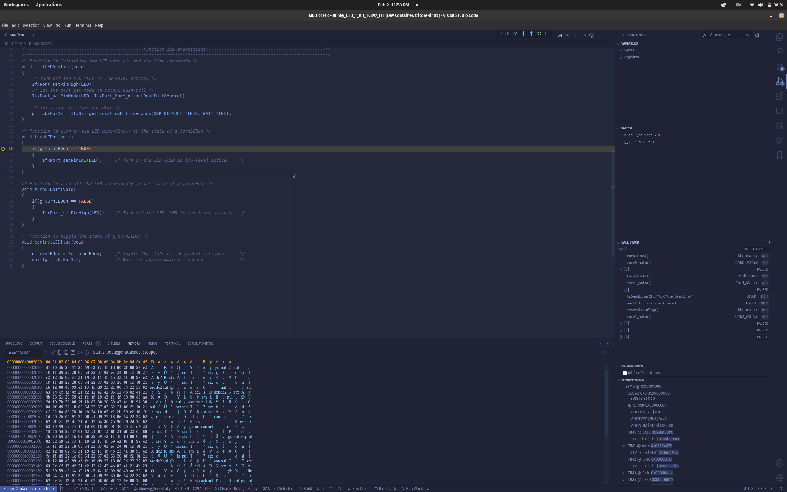

# TC39 Devlopment with OSS Tools

Demonstrate using open source [tricore-gcc toolchain](https://github.com/NoMore201/tricore-gcc-toolchain) and [miniwiggler](https://www.infineon.com/cms/en/product/evaluation-boards/kit_dap_miniwiggler_usb/#)
howto to *flash* and *debug* a TC397 device.

## Introduction  

The primary motivation was to use a miniwiggler to do a basic debugging on aurix devices.
Compared to expensive solutions like Lauterbach and UDE this is much cheaper to perform a basic debugging and flashing.

## Prerequisites

The repository is tested to work as a docker container on native Linux and WSL2.
(I have not tested on Windows docker)

- Download the following into the [.devcontainer](/.devcontainer) folder  
  - [DAS server](https://www.infineon.com/cms/en/product/promopages/das/) the MCD server application  
  - [Aurix Flasher Tool](https://softwaretools.infineon.com/tools/com.ifx.tb.tool.aurixflashersoftwaretool)  

> [!NOTE]
> Windows users can use [usbipd-win](https://github.com/dorssel/usbipd-win) to attach the device to WSL2, the docker container runs in
  privilege mode and can see all the usb devices.
  Run `winget install usbipd` in powershell to install it.
  [wsl-usb-manager](https://github.com/nickbeth/wsl-usb-manager) provides a simple GUI ontop of usbipd-win.

- All subsequent dependencies are dockerized  
- Copy the [udev rules](./.vscode/99-miniwiggler-tricore.rules) into `/etc/udev/rules.d/`  
  This will ensure that the miniwiggler is attached to a `plugdev` user group.

## Compiling and programming  

Before testing this code example:  

- Power the board through the dedicated power connector
- Connect the board to the PC through the USB interface

- Launch repo in container
- Execution steps :
    Run the below commands in terminal

  ```shell
  just configure
  just build

## Run and Debug

- Flashing and Launch GDB server ```just flash-blinky```
- Debugging :
  From vscode launch ```F5 > Launch miniwiggler```  
  select the example elf to debug  
  *tricore-gdb-das is launched automatically as a PreLaunchTask*

  

## References  

- <https://github.com/Infineon/AURIX_code_examples>
- <https://github.com/NoMore201/aurix-cmake-code-sample>
